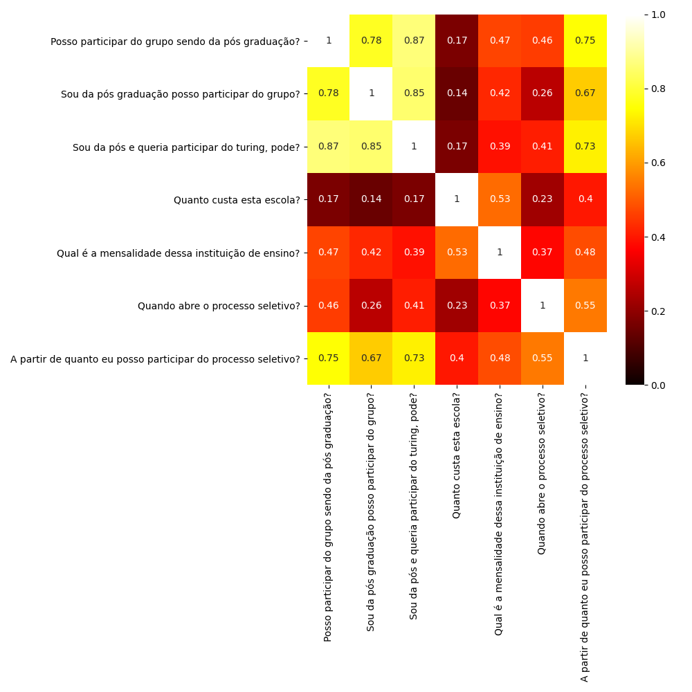
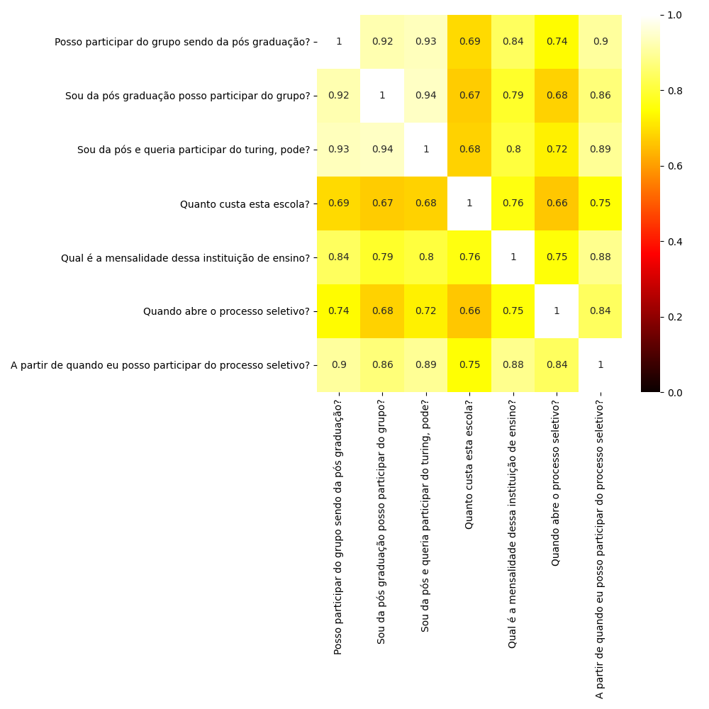
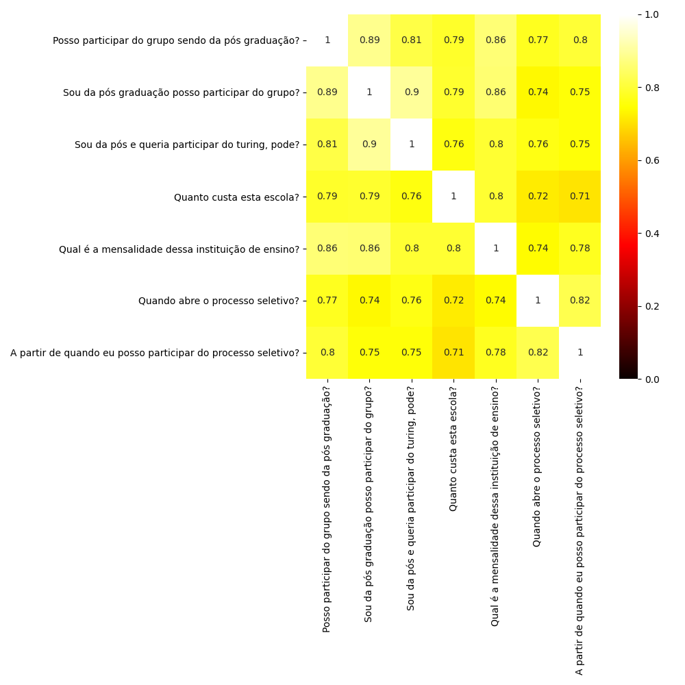
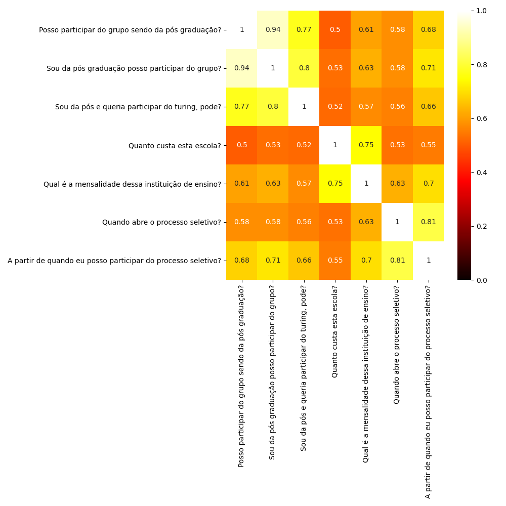

# Projeto Chatbot

O Grupo Turing tem crescido e cada vez atraído mais pessoas para nossas redes sociais. Frequentemente, recebemos dúvidas em nosso facebook e instagram acerca de informações básicas sobre o grupo, por exemplo:
- Quanto custa essa escola?
- Quando abre o processo seletivo?
- Como faço para divulgar uma vaga de estágio?
- Alunos de fora da poli podem participar do grupo?

Dessa forma, a área de foco de NLP decidiu criar um chatbot para respoder essas e outras questões.

Como não tínhamos acesso às conversas antigas no nosso facebook, precisávamos de uma abordagem em que não precisássemos treinar modelos, mas operar apenas com elementos linguísticos.

A abordagem escolhida foi a de similaridade de documentos.

# Overview - o que são embeddings

# Comparação de Embeddings
## Word2Vec

## Glove

## Elmo

## Bert

